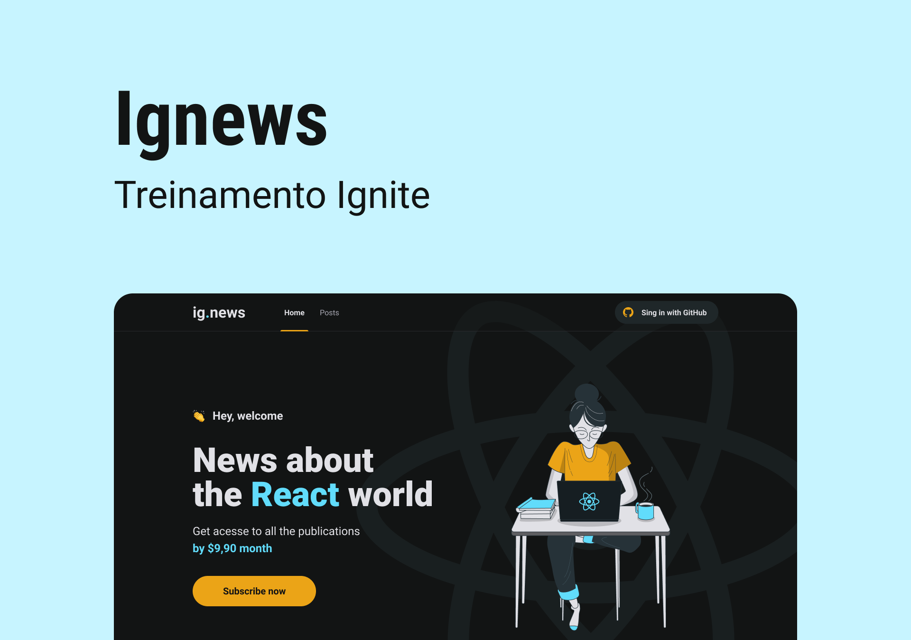

<h1 align="center">
    
</h1>

<p align="center">
  <a href="#technologies">Technologies</a>&nbsp;&nbsp;&nbsp;|&nbsp;&nbsp;&nbsp;
  <a href="#-project">Project</a>&nbsp;&nbsp;&nbsp;|&nbsp;&nbsp;&nbsp;
  <a href="#-layout">Layout</a>&nbsp;&nbsp;&nbsp;|&nbsp;&nbsp;&nbsp;
  <a href="#-license">License</a>
</p>

<br>

## 🧪 Technologies

This project was developed using the following technologies:

- [NextJs](https://nextjs.org)
- [ReactJs](https://reactjs.org)
- [TypeScript](https://www.typescriptlang.org/)
- [StyledComponents](https://styled-components.com)
- [MirageJS](https://miragejs.com)


## 🚀 Getting started

Clone the project and access the folder

```zsh
$ git clone https://github.com/abraaodev/ignews.git && cd ignews
```

Follow the steps below

```zsh
# Install the dependencies
$ yarn
# Start the project
$ yarn dev
```

## 💻 Project

[Ignews] came to remind you to exercise always! 💜


## 📝 License

This project is licensed under the MIT License. See the [LICENSE](LICENSE.md) file for details.

---

<p align="center">Made with 💜 by Abraão DEV</p>